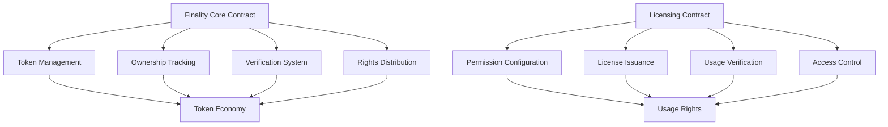

# Finality Connect

A decentralized protocol for cross-chain token licensing and verification on blockchain networks.

## Overview

Finality Connect enables:
- Cross-chain token licensing
- Flexible usage rights management
- Secure token verification
- Multi-tier access control
- Transparent licensing mechanisms

Key Features:
- Decentralized licensing infrastructure
- Flexible permission models
- Interoperable token verification
- Secure transfer of usage rights
- Blockchain-agnostic design

## Architecture

The protocol consists of two primary smart contracts handling core functionality:



## Contract Documentation

### Finality Core (`finality-core.clar`)

The core contract manages fundamental token functionality:
- Token creation and ownership tracking
- Transfer and verification mechanisms
- Rights management
- Metadata handling

Key features:
- Configurable royalty percentages
- Platform fee support
- Metadata immutability
- Cross-chain compatibility

### Licensing (`finality-licensing.clar`)

Handles token licensing and usage rights:
- Flexible licensing tiers
- Configurable access levels
- License verification system
- Usage tracking and management

## Getting Started

### Prerequisites
- Clarinet
- Blockchain wallet
- Native tokens for transactions

### Basic Usage

1. Creating a token:
```clarity
(contract-call? .finality-core create-token "metadata-uri" u100)
```

2. Listing a token for sale:
```clarity
(contract-call? .finality-core list-token token-id price)
```

3. Configuring a license:
```clarity
(contract-call? .finality-licensing configure-license-tier token-id tier price duration-days max-licenses)
```

## Function Reference

### Core Contract Functions

#### Token Management
```clarity
(create-token (metadata-uri (string-utf8 256)) (royalty-percentage uint))
(update-token-metadata (token-id uint) (new-metadata-uri (string-utf8 256)))
(freeze-token-metadata (token-id uint))
```

#### Trading
```clarity
(list-token (token-id uint) (price uint))
(buy-token (token-id uint))
(make-offer (token-id uint) (offer-price uint) (expiry uint))
(accept-offer (token-id uint) (offerer principal))
```

### Licensing Functions

#### License Management
```clarity
(configure-license-tier (token-id uint) (tier uint) (price uint) (duration-days uint) (max-licenses (optional uint)))
(purchase-license (token-id uint) (tier uint))
(renew-license (token-id uint) (tier uint))
(revoke-license (token-id uint) (tier uint) (licensee principal))
```

## Development

### Testing
Run tests using Clarinet:
```bash
clarinet test
```

### Local Development
1. Start local chain:
```bash
clarinet integrate
```

2. Deploy contracts:
```bash
clarinet deploy
```

## Security Considerations

### Core Contract
- Royalty calculations use basis points to avoid floating-point issues
- Ownership checks prevent unauthorized transfers
- Metadata freezing prevents post-sale modifications

### Licensing Contract
- License validation prevents unauthorized usage
- Expiration tracking ensures proper access control
- Creator-only license configuration and revocation
- Maximum license count enforcement

### General
- All financial transactions verify sufficient funds
- Access control checks on privileged operations
- State changes are atomic and consistent